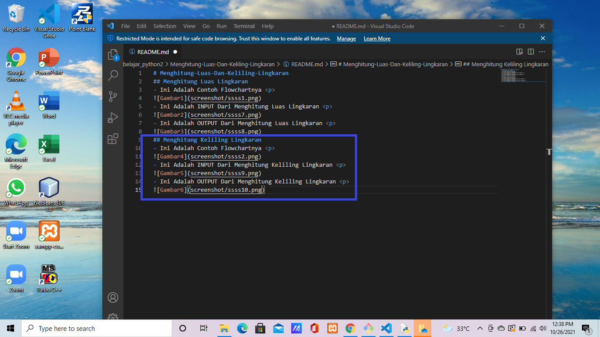

# Menghitung-Luas-Dan-Keliling-Lingkaran
## Menghitung Luas Lingkaran
- Ini Adalah Contoh Flowchartnya 

- Ini Adalah INPUT Dari Menghitung Luas Lingkaran 

- Ini Adalah OUTPUT Dari Menghitung Luas Lingkaran 

## Menghitung Keliling Lingkaran
- Ini Adalah Contoh Flowchartnya 

- Ini Adalah INPUT Dari Menghitung Keliling Lingkaran 

- Ini Adalah OUTPUT Dari Menghitung Keliling Lingkaran 

## Penjelasan File README.md
- Ini Adalah Kodingan Untuk Menampilkan File Luas Lingkaran 

- Ini Adalah Kodingan Untuk Menampilkan File Keliling Lingkaran 

- Ini Adalah Keseluruhan Kodinganya 

